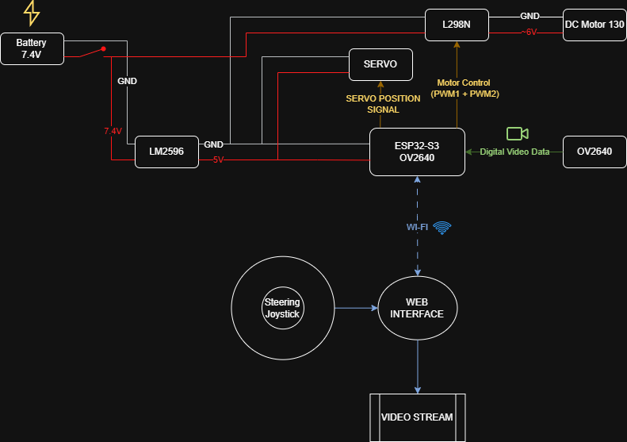
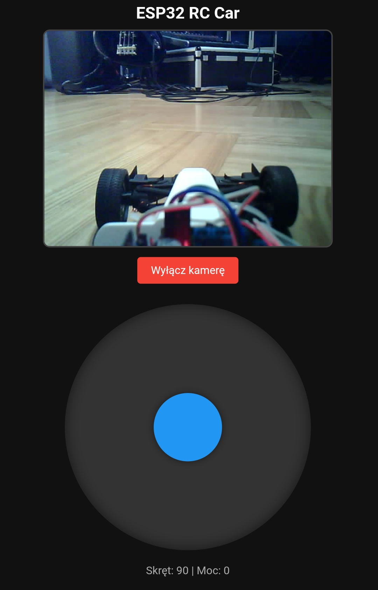

#  Samochodzik RC z Kamerą

Autonomiczny samochodzik RC sterowany przez Wi-Fi, oparty o mikrokontroler ESP32-S3 z wbudowaną obsługą kamery. Umożliwia zdalne sterowanie pojazdem przez przeglądarkę internetową oraz podgląd obrazu w czasie rzeczywistym.

##  Architektura systemu:

---

##  Opis projektu

Pojazd wykorzystuje silnik prądu stałego (DC) do napędu tylnej osi, sterowany za pomocą mostka H (L298N), oraz serwomechanizm do kontroli skrętu przednich kół. ESP32 działa jako punkt dostępu (Access Point) — użytkownik łączy się smartfonem/komputerem i steruje pojazdem przez interfejs webowy z joystickiem (jazda przód/tył oraz skręt lewo/prawo).

---

##  Funkcjonalności

-  Sterowanie pojazdem przez Wi-Fi (ESP32 jako Access Point)
-  Strona WWW hostowana bezpośrednio na ESP32
-  Streaming obrazu z kamery w czasie rzeczywistym
-  Sterowanie prędkością (PWM, mostek H), kierunkiem jazdy i kątem skrętu (serwo)
-  Zasilanie z baterii 7.4V + przetwornica step-down do 5V
-  FreeRTOS — podział pracy procesora na dwa zadania (odbiór danych z WebSocketa + sterowanie pojazdem)

---

##  Technologie i komponenty

| Kategoria | Szczegóły |
|-----------|-----------|
| Mikrokontroler | ESP32-S3 |
| Kamera | OV2640 |
| Sterownik silnika | Mostek H L298N |
| Serwomechanizm | MG-90S |
| Zasilanie | Akumulator Li-Ion 7.4V + przetwornica DC-DC (step-down 5V) |
| Frontend | HTML / CSS / JavaScript (wirtualny joystick) |
| Komunikacja | Wi-Fi (Access Point + HTTP server + WebSocket) |
| RTOS | FreeRTOS |

---

**Hardware:** ESP32-S3 · Silnik DC + mostek H · Serwo · Zasilanie (7.4V → 5V)

**Firmware (ESP32):** Serwer HTTP · Obsługa kamery (stream) · Sterowanie PWM (silnik) · Obsługa żądań z przeglądarki

**Frontend:** Strona WWW hostowana na ESP32 · Podgląd wideo na żywo · Wirtualny joystick 

---

##  Osiągi

| Parametr | Wartość |
|----------|---------|
| Prędkość maksymalna | ~9 km/h |
| Masa pojazdu | ~340 g |
| Zasięg Wi-Fi | do 50 m |
| Zasięg transmisji wideo | do 20 m |

---

##  Prezentacja wideo

---

##  Autor

**Radosław Dregan** — Student Automatyki i Robotyki, Politechnika Śląska

